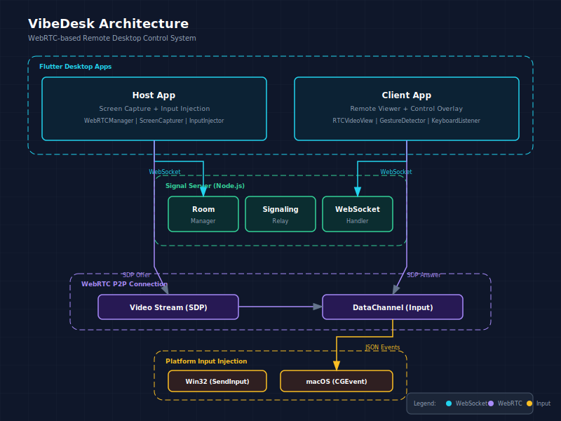

# VibeDesk

基于 WebRTC 的远程桌面控制系统。共享屏幕并允许远程控制。



## 功能特性

- **屏幕共享**：主机通过 WebRTC P2P 连接共享屏幕
- **远程查看**：客户端实时查看主机屏幕
- **远程控制**：客户端可以点击、移动和输入键盘指令
- **低延迟**：通过 WebRTC 直接 P2P 连接

## 平台支持

| 平台 | 屏幕查看 | 远程控制 |
|------|---------|---------|
| Windows | ✓ | ✓ |
| macOS | ✓ | ✓ |
| Linux | ✓ | ✗（即将支持） |

## 下载

从 [Releases](https://github.com/wu529778790/VibeDesk/releases) 下载对应平台的最新版本。

- **Windows**：`.exe` 安装包
- **macOS**：`.app` 应用
- **Linux**：`.AppImage` 或 `.deb` 安装包

## 快速开始

### 1. 部署信令服务器（Docker）

信令服务器已预构建，提供 Docker 镜像。

```bash
# 拉取并运行最新镜像
docker run -d -p 6666:6666 ghcr.io/wu529778790/vibedesk-signal-server:latest
```

或使用 docker-compose：

```yaml
version: '3.8'
services:
  signal-server:
    image: ghcr.io/wu529778790/vibedesk-signal-server:latest
    ports:
      - "6666:6666"
    restart: unless-stopped
```

### 2. 连接

**主机（被控制端）：**
1. 打开 VibeDesk
2. 选择"共享屏幕"
3. 输入信令服务器地址（默认：`ws://your-server:6666`）
4. 点击"连接"
5. 将显示的房间码分享给客户端

**客户端（控制端）：**
1. 打开 VibeDesk
2. 选择"远程控制"
3. 输入信令服务器地址
4. 点击"连接"
5. 输入主机提供的房间码
6. 点击"加入房间"

### 3. 控制

连接成功后，你可以：
- **点击**与主机屏幕交互
- **移动鼠标**进行导航
- **打字**发送键盘输入
- **右键**打开上下文菜单

## 配置

### 信令服务器

信令服务器默认监听端口 `6666`。修改方法：

```bash
docker run -d -p 8080:8080 ghcr.io/wu529778790/vibedesk-signal-server:latest
```

### ICE 服务器

默认使用 Google 公共 STUN 服务器。生产环境或需要 NAT 穿透时，请在应用设置中配置 TURN 服务器。

## 架构说明

- **信令服务器**：处理房间管理和 WebRTC 信令
- **主机**：捕获屏幕，通过 WebRTC 发送视频，接收输入事件
- **客户端**：显示远程屏幕，捕获输入，通过 DataChannel 发送
- **WebRTC P2P**：视频和输入数据的直接点对点连接
- **输入注入**：平台特定的鼠标/键盘模拟（Win32、CGEvent）

## 技术栈

- **前端**：Flutter Desktop（WebRTC、Riverpod）
- **后端**：Node.js + Fastify + WebSocket
- **协议**：WebRTC（视频流 + DataChannel）
- **输入注入**：Win32 API（Windows）、CGEvent（macOS）

## 项目规划

查看 [ROADMAP.md](ROADMAP.md) 了解项目路线图和未来计划。

## 许可证

MIT
